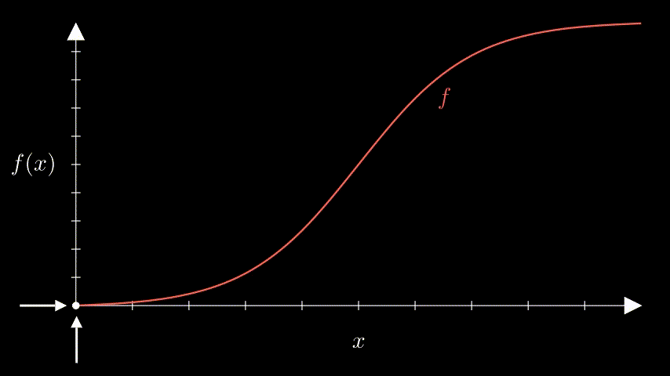

Source code for visualization of multivariable calculus concepts using MANIM.

## Demo

## How to Run
* Install/update Manim. (I use version `Manim Community v0.19.0`)(https://github.com/manimCommunity/manim)
* Clone this repo with `git clone https://github.com/nicominguez/CII.git`
* Run `manim -ql -p CII/multivar_cont_diff.py` 
